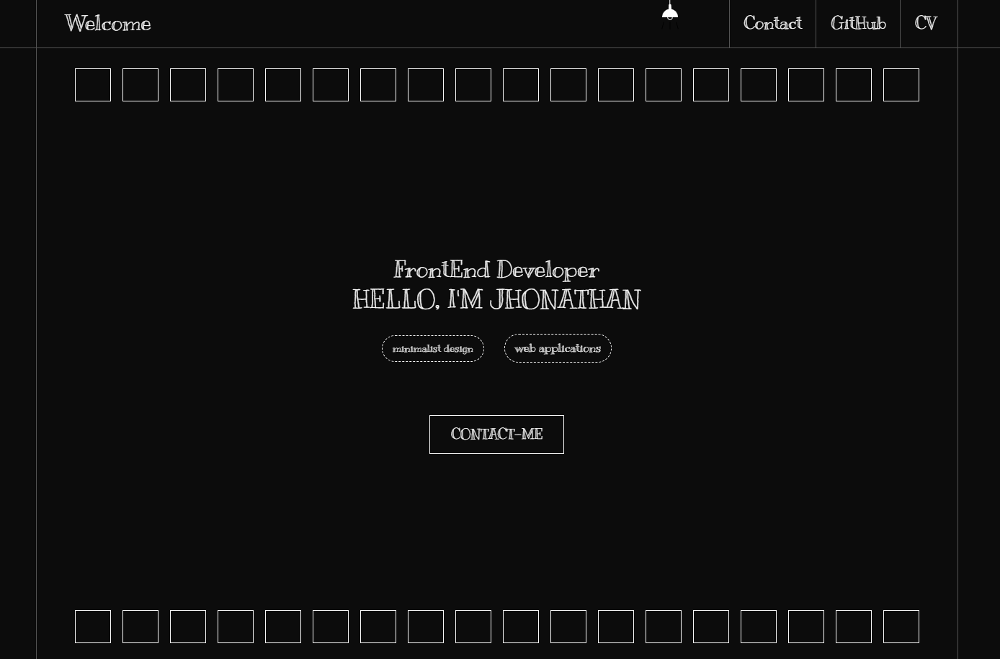
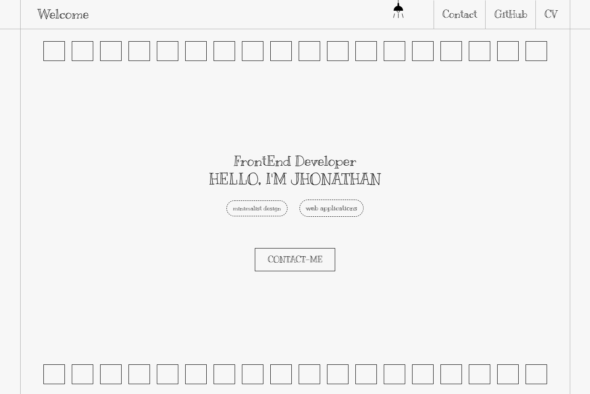
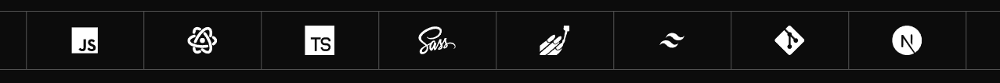
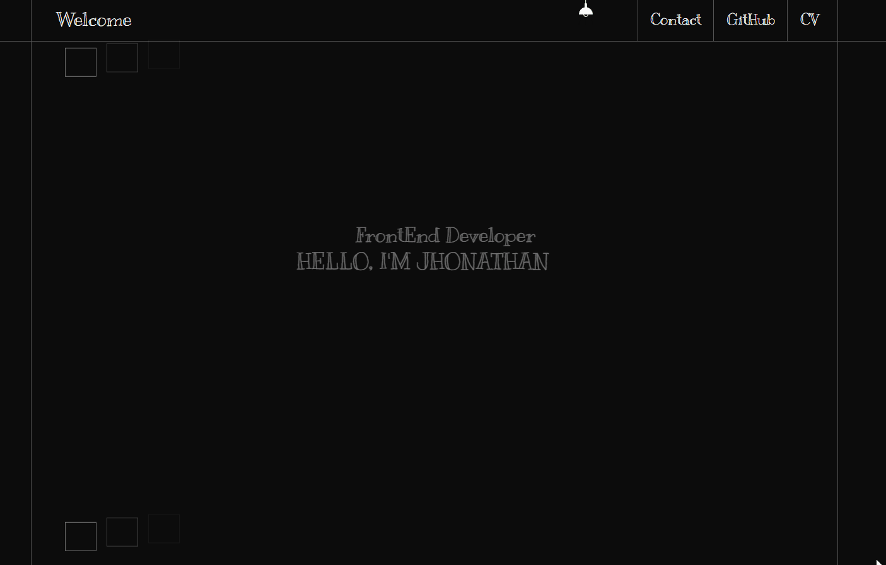

# Portfolio



## Table of Contents

- [About the Project](#about-the-project)
- [Features](#features)
  - [Theme Switcher](#theme-switcher)
  - [Carousel Skills](#carousel-skills)
  - [Animation](#animation)
  - [Project Pop-up](#project-pop-up)
- [Built with](#built-with)
- [Run the application](#run-the-application)
- [Author](#author)
- [License](#license)

## About the project

This is my portfolio, where I showcase some of the projects that I've created along my journey so far, share a bit about myself, and highlight the useful skills I've acquired.

## Features

The application has the following features:

### Theme Switcher

There is a theme switcher that allows users to toggle between light and dark themes, saving their preference in localStorage. This feature was implemented using NextThemes.

_Light theme_


_Dark theme_


### Carousel Skills



In This part of the project, I implemented a carousel showcasing the skills I've acquired, using the Embla Carousel library.

### Animation



The animation in this project where implemented using two TailwindCSS plugins: TailwindCSS Animated and TailwindCSS Intersect.

### Project Pop-up

<image src="docs/project-modal.png">

In this feature, users can view a pop-up displaying more deatils about the selected project.

## Built with

This project was built with the following technologies:

| Technologies                                                                    | Description                                                                               |
| ------------------------------------------------------------------------------- | ----------------------------------------------------------------------------------------- |
| [Next.js ](https://nextjs.org)                                                  | A framework for building static and dynamic web applications.                             |
| [React ](https://react.dev)                                                     | A library for web and native user interfaces.                                             |
| [TypeScript ](https://www.typescriptlang.org/)                                  | A strongly typed programming language built on JavaScript.                                |
| [TailwindCSS ](https://tailwindcss.com)                                         | A utility-first CSS framework packed with classes.                                        |
| [TailwindCSS Animated ](https://www.tailwindcss-animated.com/)                  | A TailwindCSS plugin for animations.                                                      |
| [TailwindCSS Intersect ](https://github.com/heidkaemper/tailwindcss-intersect/) | A TailwindCSS plugin for displaying animations on scroll.                                 |
| [Embla Carousel ](https://www.embla-carousel.com/)                              | A lightweight library for carousels.                                                      |
| [Next Themes ](https://github.com/pacocoursey/next-themes)                      | An easy-to-use package that allows switching between themes in Next.js.                   |
| [React Responsive ](https://www.npmjs.com/package/react-responsive)             | Media queries in React for responsive design                                              |
| [Clsx ](https://www.npmjs.com/package/clsx)                                     | A tiny utility for constructing classname strings conditionally.                          |
| [Tailwind Merge ](https://www.npmjs.com/package/tailwind-merge)                 | Utility function to efficiently merge Tailwind CSS classes in JS without style conflicts. |
| [React Icons ](https://react-icons.github.io/react-icons/)                      | Easily include popular icons in React projects.                                           |
| [Iconify ](https://iconify.design/)                                             | A large collection of icons.                                                              |
| [Prettier ](https://prettier.io/)                                               | A code formatter.                                                                         |
| [Eslint ](https://eslint.org/)                                                  | Find and fix problems in JavaScript code.                                                 |

## Run the application

To run the application on your machine, follow the next steps:

1. Clone the repositorie

   ```sh
   git clone https://github.com/JhowBRCG/my-portfolio.git
   ```

2. Install the dependencies

   ```sh
   npm install
   ```

3. Initialize the server

   ```sh
   npm run dev
   ```

4. Now you can see the application in real time by putting the url http://localhost:3000/ in the browser of your choice.

## Author

Created by [@jhowbrcg](https://github.com/JhowBRCG) - fell free to contact me!

## License

This project is licensed under [MIT](https://opensource.org/licenses/MIT) license.
